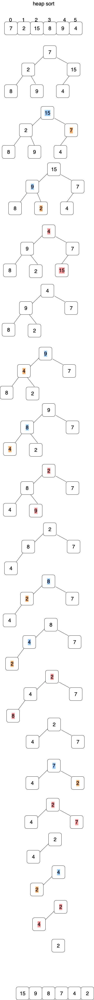
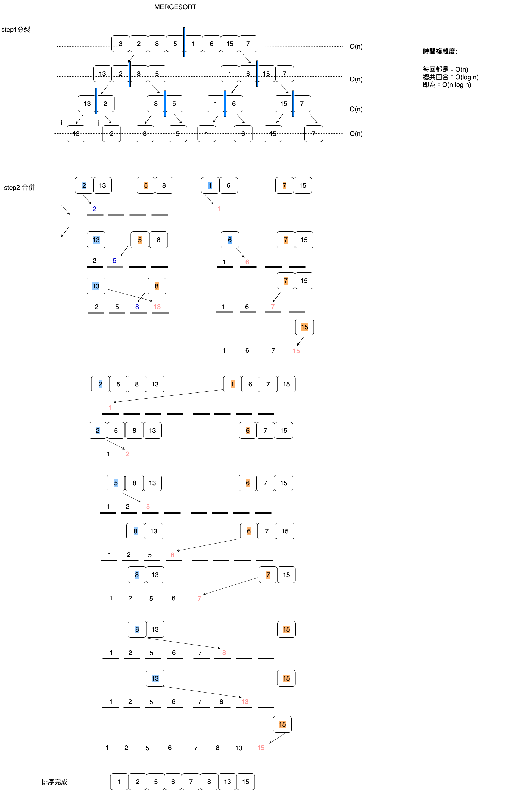

>hw2. 
[詳細筆記](https://github.com/hello02923/lai/tree/master/content/week6#week6). 

#heap&merge 比較  
>Heap sort是比merge sort還要來的**快速**, 但是heap sort 是in-place sorting(只需一額外記錄空間) , 也就是說它不像merge sort 每次method call 都需要去跟記憶體要一塊位置,但整體來說Heap sort 是比merge sort還要好的 .  
  
  

###heapsort 參考連結:  
https://www.youtube.com/watch?v=MtQL_ll5KhQ.   
https://jason-chen-1992.weebly.com/home/selection-merge-heap. 
http://notepad.yehyeh.net/Content/Algorithm/Sort/Heap/Heap.php. 
https://zh.wikipedia.org/wiki/堆排序.   
http://alrightchiu.github.io/SecondRound/comparison-sort-heap-sortdui-ji-pai-xu-fa.html

###mergesort 參考資料：  
http://alrightchiu.github.io/SecondRound/comparison-sort-merge-sorthe-bing-pai-xu-fa.html。   
https://jason-chen-1992.weebly.com/home/selection-merge-heap. 
http://spaces.isu.edu.tw/upload/18833/3/web/sorting.htm

    

#流程圖。

heap.   

merge. 
 

